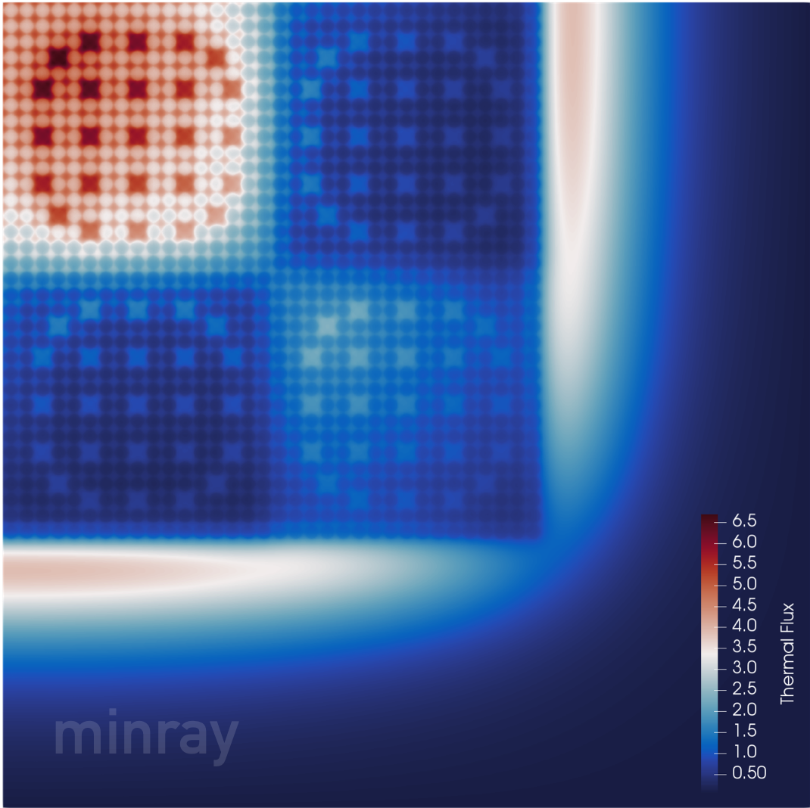

# minray

## Overview

A minimal implementation of the random ray method for neutral particle transport. This purpose of this code is to serve as an open source performance benchmark for random ray, while still being able to perform the real neutronics and produce real solutions.

Key Features:
  - Much simpler than the full application (ARRC) -- allowing it to act as a reference implementation
  - Complex enough to converge real solutions to neutron transport problems (see picture below generated with minray)
  - Simplified geometry treatment limits complexity (can only simulate 2D heterogeneous Cartesian geometries)
  - Hard coded reactor simulation problem of interest: 2D C5G7
  - Kernelized for easy porting to accelerator languages

## Installing and compiling

The CPU version of minray is written in C with no dependencies.

The OpenCL version of minray requires an OpenCL capable compiler. By default, minray requires support for OpenCL 2.0, however this is just to more easily execute a reduction kernel. If support for OpenCL 1.0 or 1.2 is desired, the integer and floating point reduction kernels simply need to be rewritten so as to avoid the use of the `work_group_reduce_add()` OpenCL 2.0 function.

Use the included makefile each the desired source directory to install. Several options are available as toggles at the top of the makefile.

## Configuring a run

The command line options are:

`./minray <options>`:
 - `-r <rays>`                    Number of discrete rays
 - `-d <distance per ray>`        Travel distance per ray (cm)
 - `-i <inactive iterations>`     Set fixed number of inactive power iterations
 - `-a <active iterations>`       Set fixed number of active power iterations
 - `-s <seed>`                    Random number generator seed (for reproducibility)
 - `-m <1, 2, 4, 8, 16, 32>`      Multiplier to increase/decrease problem size/resolution
 - `-p`                           Enables plotting
 - `-v <small, medium, large>`    Executes a specific validation probem to test for correctness

### Default Behavior

Run the appliation as `./minray` to get the default problem. This is a short performance run that uses a realistic problem size per iteration. However, only 20 iterations are run so as to keep the overall runtime low -- meaning the solution will not be converged. The default mode is intended for performance analysis.

### Validation

When devloping the code or running it on a new system or compiler, it is advisable to test it out using the optional validation mode. Passing the `-v <small, medium, large>` argument will run the code with a pre-configured problem size and compare the generated eigenvalue to a reference value. Passing requires the eigenvalues match to within a small delta (very small differences due floating point non-associativity are expected).

The `-v small` should run within a second or so and is meant as a "smoke test" to rapidly debug code. The `-v medium` and `-v large` options run progressively larger problems, with the large option being representative of a full simulation to convergence.

### Other options

Besides the benchmark and validation modes, there are a number of other options for doing custom simulations. For instance, if one wanted to investigate the effect of the Cartesian mesh resolution on simulation accuracy, you could use the mesh multiplier option `-m <value>` to increase the mesh fineness. At the coarsest setting (`-m 1`) only a single mesh region is assigned to each pin cell in the 2D C5G7 problem. There are input files available for the `-m <1, 2, 4, 8, 16, 32>` settings. If only the `-m` argument is given, minray will automatically increase the number of rays used so as to ensure the mesh is adequately sampled.

The user is also able to manually reset the number of rays used and the distance per ray (10 cm by default).

By default, the number of inactive and active iterations used is only 10 so as ti keep the runtime low. However, this is not enough iterations to converge a simulation. For a problem of this scale, it is more likely that 1000 inactive and 1000 active iterations would be required, which can be set as: `-i 1000 -a 1000`.

By default, unless running a validation problem, the seed used to sample the random rays is based on the time of program launch. A seed can manually be set using the `-s <seed>` argument, which may be useful for debugging when reproducibility is desired.

To plot material/geometry data and several flux spectrums, the `-p` argument can be given. Plots are output in binary .vtk format, which can be directly loaded into plotting programs like [Paraview](https://www.paraview.org).

## Citing minray

Papers wishing to cite random ray, ARRC, or minray should in general refer to:

John R. Tramm, Kord S. Smith, Benoit Forget, and Andrew R. Siegel.  The Random
Ray Method for neutral particle transport. Journal of Computational Physics,
342:229 - 252, 2017. https://doi.org/10.1016/j.jcp.2017.04.038

For convenience, the bibtex entry is given below:

@article{Tramm2017,
title = {{The Random Ray Method} for neutral particle transport},
journal = "Journal of Computational Physics",
volume = "342",
pages = "229 - 252",
year = "2017",
issn = "0021-9991",
doi = "https://doi.org/10.1016/j.jcp.2017.04.038",
url = "http://www.sciencedirect.com/science/article/pii/S0021999117303170",
author = "John R. Tramm and Kord S. Smith and Benoit Forget and Andrew R. Siegel",
}
